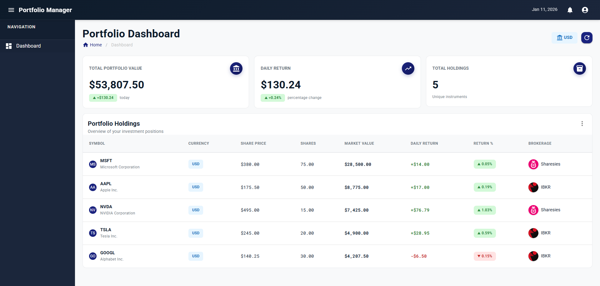
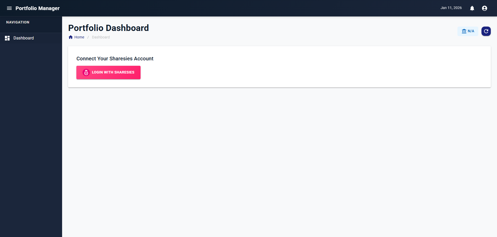
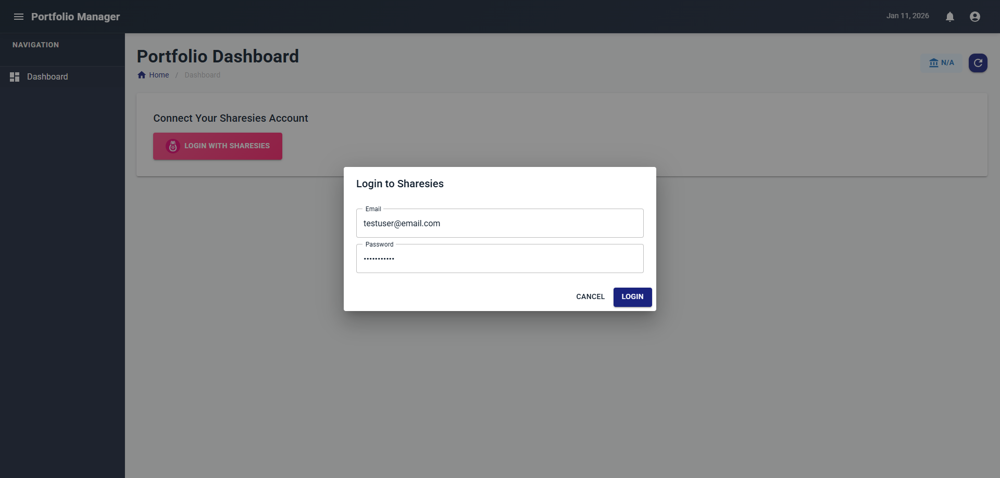
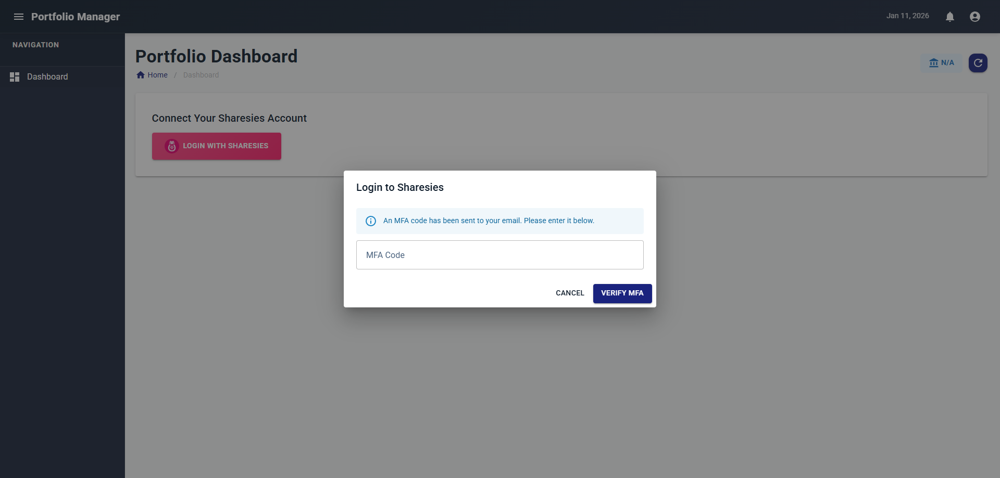

# PortfolioDashboard

PortfolioDashboard is a .NET 9.0 solution for managing and visualising investment portfolios across multiple brokerages. It provides a modern web interface for viewing aggregated portfolio data from Sharesies and Interactive Brokers.

## Screenshots

### Dashboard

*Portfolio overview with real-time analytics, holdings breakdown, and multi-brokerage support*

### Login Flow
<table>
  <tr>
    <td><br/><em>Initial login page</em></td>
    <td><br/><em>Enter your credentials</em></td>
    <td><br/><em>MFA code verification</em></td>
  </tr>
</table>

## Features

- **Multi-Brokerage Portfolio Aggregation** - View holdings from multiple brokers in one dashboard
- **Real-Time Analytics** - Track total value, daily returns, and performance metrics
- **Secure Authentication** - MFA support for Sharesies login
- **Holdings Management** - Detailed instrument breakdown with returns tracking
- **Modern UI** - Blazor WebAssembly with MudBlazor Material Design components

## Projects

- **PortfolioManager.Api**: ASP.NET Core Web API providing REST endpoints for brokerage integrations
- **PortfolioManager.Web**: Blazor WebAssembly frontend with portfolio dashboard and analytics
- **PortfolioManager.Core**: Core business logic, domain models, and brokerage client implementations
- **PortfolioManager.Contracts**: Shared DTOs and contracts for API/Core communication
- **PortfolioManager.Api.Tests**: Integration tests for API endpoints
- **PortfolioManager.Core.Tests**: Unit tests for core business logic

## Supported Brokerages

### Sharesies ✅ Fully Supported
- Email/password login with MFA support
- Portfolio data retrieval
- Instrument details and pricing
- Real-time holdings tracking

### Interactive Brokers (IBKR) ⚠️ In Development
- QR code authentication (Playwright automation)
- Account and position data (implementation in progress)

## Getting Started

### Prerequisites
- [.NET 9.0 SDK](https://dotnet.microsoft.com/download/dotnet/9.0)
- Modern web browser (Chrome, Edge, Firefox, Safari)

### Installation

1. **Clone the repository**
   ```sh
   git clone <repo-url>
   cd PortfolioDashboard
   ```

2. **Restore dependencies**
   ```sh
   dotnet restore
   ```

3. **Build the solution**
   ```sh
   dotnet build
   ```

4. **Run tests**
   ```sh
   dotnet test
   ```

### Running the Application

1. **Start the API** (Terminal 1)
   ```sh
   dotnet run --project PortfolioManager.Api
   ```
   - API runs on `http://localhost:5269`
   - Swagger UI available at `http://localhost:5269/swagger`

2. **Start the Web App** (Terminal 2)
   ```sh
   dotnet run --project PortfolioManager.Web
   ```
   - Web app runs on `http://localhost:5262` or `https://localhost:7262`

3. **Login with Sharesies**
   - Click "Login with Sharesies" on the dashboard
   - Enter your Sharesies credentials
   - Complete MFA verification if enabled
   - View your portfolio data

## Configuration

### API Settings (appsettings.json)
- **Sentry DSN**: Error tracking integration (optional)
- **CORS Origins**: Configured for local development

### Test Credentials (appsettings.template.json)
For running integration tests, create `appsettings.json` in test projects:
```json
{
  "Sharesies": {
    "Email": "your-email@example.com",
    "Password": "your-password"
  },
  "IBKR": {
    "Username": "your-username",
    "Password": "your-password"
  }
}
```

## Architecture

### API Endpoints

**Sharesies** (`/api/sharesies`)
- `POST /login` - Authenticate with email/password
- `POST /login/mfa` - Verify MFA code
- `GET /profile` - Get user profile
- `GET /portfolio` - Get portfolio with holdings

**Interactive Brokers** (`/api/ibkr`)
- `POST /start` - Initiate QR authentication
- `GET /status/{sessionId}` - Check auth status
- `POST /complete` - Complete authentication

### Technology Stack
- **Backend**: ASP.NET Core 9.0 Web API
- **Frontend**: Blazor WebAssembly 9.0
- **UI Framework**: MudBlazor 8.15.0
- **Automation**: Microsoft Playwright (for IBKR)
- **Error Tracking**: Sentry
- **API Documentation**: Swagger/OpenAPI

## Contributing
Pull requests are welcome. For major changes, please open an issue first to discuss what you would like to change.

Please ensure tests pass before submitting PRs:
```sh
dotnet test
```

## License
This project is licensed under the MIT License.
