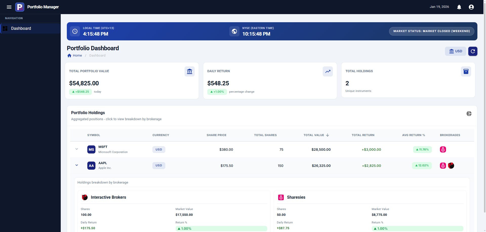
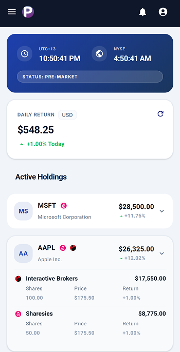
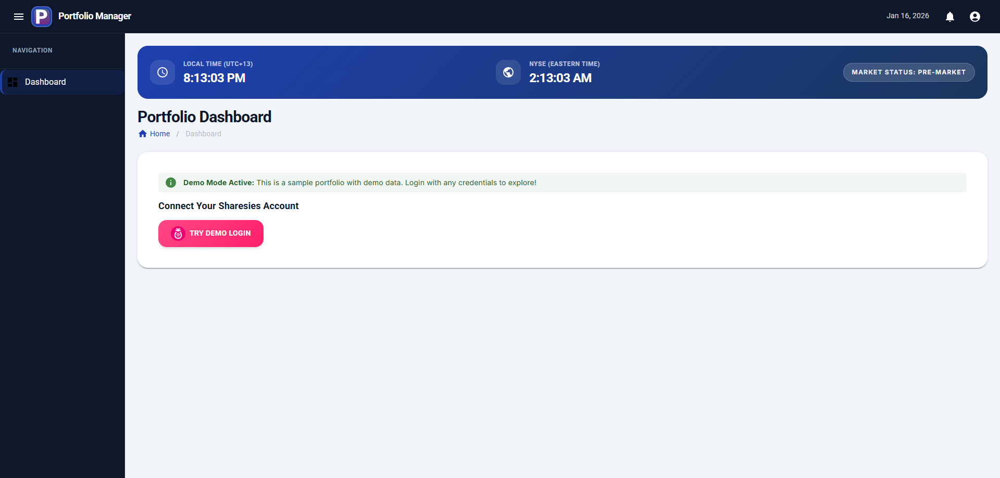
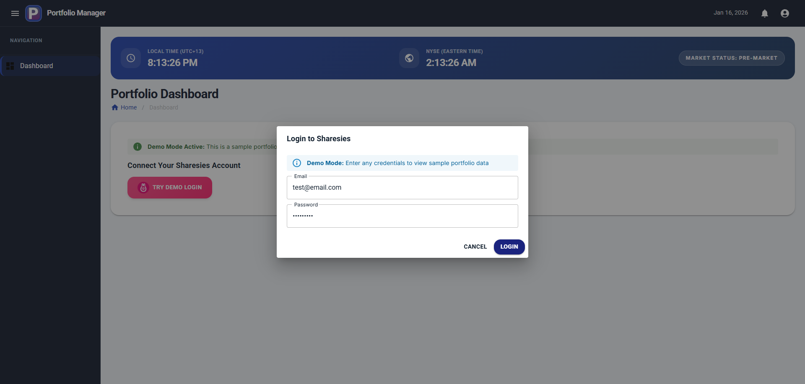
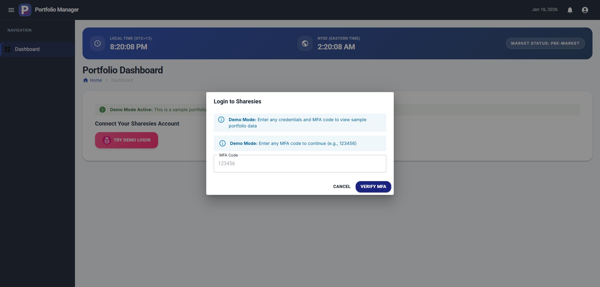

# PortfolioDashboard

[](https://github.com/spurs899/portfolio-dashboard/actions/workflows/build-test.yml)
[](https://github.com/spurs899/portfolio-dashboard/actions/workflows/deploy.yml)
[](https://dotnet.microsoft.com/)
[](LICENSE)

PortfolioDashboard is a .NET 9.0 solution for managing and visualising investment portfolios across multiple brokerages. It provides a modern web interface for viewing aggregated portfolio data from Sharesies and Interactive Brokers.

**🚀 [Live Demo](https://spurs899.github.io/portfolio-dashboard/)** - View the demo with sample portfolio data

## CI/CD

### Build and Test
Automatically runs on every push and pull request to `master`, `main`, or `develop` branches. Builds all projects and runs 22+ unit tests to ensure code quality.

### Deploy to GitHub Pages
Manual deployment workflow for the demo site. Deploys a Blazor WASM app with demo data (no API required).

**To deploy manually:**
1. Go to Actions → "Deploy to GitHub Pages"
2. Click "Run workflow" → Select `master` branch
3. Site deploys to [https://spurs899.github.io/portfolio-dashboard/](https://spurs899.github.io/portfolio-dashboard/)

## Screenshots

### Dashboard

*Portfolio overview with real-time analytics, holdings breakdown, and multi-brokerage support*

### Mobile View


*Responsive mobile layout with condensed holdings list and daily return summary*

### Login Flow
<table>
  <tr>
    <td><br/><em>Initial login page</em></td>
    <td><br/><em>Enter your credentials</em></td>
    <td><br/><em>MFA code verification</em></td>
  </tr>
</table>

## Features

- **Multi-Brokerage Portfolio Aggregation** - View holdings from multiple brokers in one dashboard
- **Real-Time Analytics** - Track total value, daily returns, and performance metrics
- **NYSE Market Status** - Live market hours tracking with holiday calendar support
- **Secure Authentication** - MFA support for Sharesies login
- **Holdings Management** - Detailed instrument breakdown with returns tracking
- **Modern UI** - Blazor WebAssembly with MudBlazor Material Design components
- **Demo Mode** - Try the dashboard with sample data without credentials

## Projects

- **PortfolioManager.Api**: ASP.NET Core Web API providing REST endpoints for brokerage integrations
- **PortfolioManager.Web**: Blazor WebAssembly frontend with portfolio dashboard and analytics
- **PortfolioManager.Core**: Core business logic, domain models, and brokerage client implementations
- **PortfolioManager.Contracts**: Shared DTOs and contracts for API/Core communication
- **PortfolioManager.Api.Tests**: Integration tests for API endpoints
- **PortfolioManager.Core.Tests**: Unit tests for core business logic

## Supported Brokerages

### Sharesies ✅ Fully Supported
- Email/password login with MFA support
- Portfolio data retrieval
- Instrument details and pricing
- Real-time holdings tracking

### Interactive Brokers (IBKR) ⚠️ In Development
- QR code authentication (Playwright automation)
- Account and position data (implementation in progress)

## Getting Started

### Prerequisites
- [.NET 9.0 SDK](https://dotnet.microsoft.com/download/dotnet/9.0)
- Modern web browser (Chrome, Edge, Firefox, Safari)

### Installation

1. **Clone the repository**
   ```sh
   git clone <repo-url>
   cd PortfolioDashboard
   ```

2. **Restore dependencies**
   ```sh
   dotnet restore
   ```

3. **Build the solution**
   ```sh
   dotnet build
   ```

4. **Run tests**
   ```sh
   dotnet test
   ```

### Running the Application

#### Option 1: Full Features (API + Web)

1. **Configure API Settings** (Optional - for market data)
   
   Copy `appsettings.template.json` to `appsettings.Development.json` in `PortfolioManager.Api/`:
   ```sh
   cp PortfolioManager.Api/appsettings.template.json PortfolioManager.Api/appsettings.Development.json
   ```
   
   Then add your [Polygon.io](https://polygon.io/) API key (free tier available):
   ```json
   {
     "Polygon": {
       "ApiKey": "your_api_key_here"
     }
   }
   ```
   
   **Note**: Without an API key, the app will fall back to calculated market hours (works offline).

2. **Start the API** (Terminal 1)
   ```sh
   dotnet run --project PortfolioManager.Api
   ```
   - API runs on `http://localhost:5269`
   - Swagger UI available at `http://localhost:5269/swagger`

3. **Start the Web App** (Terminal 2)
   ```sh
   dotnet run --project PortfolioManager.Web
   ```
   - Web app runs on `http://localhost:5262` or `https://localhost:7262`

4. **Login with Sharesies**
   - Click "Login with Sharesies" on the dashboard
   - Enter your Sharesies credentials
   - Complete MFA verification if enabled
   - View your portfolio data

#### Option 2: Demo Mode Only (No API Required)

Set `DemoMode: true` in `PortfolioManager.Web/wwwroot/appsettings.json`:
```json
{
  "DemoMode": true,
  "ApiBaseUrl": "http://localhost:5269"
}
```

Run just the web app:
```sh
dotnet run --project PortfolioManager.Web
```

Login with any credentials to view sample portfolio data.

## Configuration

### API Settings (appsettings.json)
- **Sentry DSN**: Error tracking integration (optional)
- **CORS Origins**: Configured for local development

### Test Credentials (appsettings.template.json)
For running integration tests, create `appsettings.json` in test projects:
```json
{
  "Sharesies": {
    "Email": "your-email@example.com",
    "Password": "your-password"
  },
  "IBKR": {
    "Username": "your-username",
    "Password": "your-password"
  }
}
```

## Architecture

### Frontend Styling
- **Design System**: Stitch Design System (Tailwind-inspired)
- **Preprocessor**: Sass/SCSS with DartSassBuilder
- **Component Library**: MudBlazor with custom overrides
- **Compilation**: Automatic during build via DartSassBuilder NuGet package

**Key styling files:**
- `wwwroot/css/app.scss` - Main stylesheet with design tokens and component styles
- `Components/*.razor.scss` - Component-scoped styles (auto-compiled)

**Cache Busting:**
After deployment, CSS and assets are versioned to force cache refresh. See [Deployment](#deployment) section.

### Technology Stack

### API Endpoints

**Sharesies** (`/api/sharesies`)
- `POST /login` - Authenticate with email/password
- `POST /login/mfa` - Verify MFA code
- `GET /profile` - Get user profile
- `GET /portfolio` - Get portfolio with holdings

**Interactive Brokers** (`/api/ibkr`)
- `POST /start` - Initiate QR authentication
- `GET /status/{sessionId}` - Check auth status
- `POST /complete` - Complete authentication

### Technology Stack
- **Backend**: ASP.NET Core 9.0 Web API
- **Frontend**: Blazor WebAssembly 9.0
- **UI Framework**: MudBlazor 8.15.0
- **Styling**: Sass/SCSS with DartSassBuilder
- **Automation**: Microsoft Playwright (for IBKR)
- **Error Tracking**: Sentry
- **API Documentation**: Swagger/OpenAPI

### Styling Architecture

The application uses **Sass (SCSS)** for all styling with automatic compilation via DartSassBuilder.

**Structure:**
- **Component-scoped styles**: Each Blazor component has its own `.razor.scss` file that compiles to `.razor.css`
  - `TimeAndMarketStatusCard.razor.scss` - Market status chip styling
  - Uses `::deep` selector to style MudBlazor child components
- **Global stylesheet**: `wwwroot/css/app.scss` - Main stylesheet with Sass variables, mixins, and responsive design
  - 100+ Sass variables for colors, spacing, typography, transitions, shadows
  - 15+ mixins for common patterns (flexbox, cards, badges, gradients, breakpoints)
  - Compiles to `wwwroot/css/app.css` automatically on build

**Code-behind pattern**: All components use the `.razor.cs` code-behind pattern for clean separation of markup and logic.

**Build process:**
```sh
dotnet build  # Automatically compiles all .scss files
```

No manual Sass compilation needed - DartSassBuilder handles it during the build.

## Deployment

### Cache Busting for Production

When deploying updates (especially CSS/styling changes), use the version update script to force browsers to load fresh assets:

```powershell
# Update version with timestamp (e.g., 20260116.1430)
.\update-version.ps1

# Or specify a custom version (e.g., 2.1.0)
.\update-version.ps1 -Version "2.1.0"
```

**What it does:**
- Updates version query strings in `index.html` (`app.css?v=X.X.X`)
- Updates the `APP_VERSION` constant for cache clearing
- Writes version to `wwwroot/version.txt`
- On user's next visit, browser automatically clears old cached assets

**Deployment workflow:**
1. Make your changes (CSS, components, etc.)
2. Run `.\update-version.ps1`
3. Build: `dotnet build`
4. Publish: `dotnet publish -c Release`
5. Deploy to hosting (GitHub Pages, Azure, etc.)

Users will automatically see the new version - no manual cache clearing needed!

### GitHub Pages Deployment

The repo includes a GitHub Actions workflow for automated deployment:

1. Go to **Actions** → **Deploy to GitHub Pages**
2. Click **Run workflow** → Select `master` branch
3. Site deploys to [https://spurs899.github.io/portfolio-dashboard/](https://spurs899.github.io/portfolio-dashboard/)

Before deploying, run `.\update-version.ps1` locally and commit the updated `index.html`.

## Contributing
Pull requests are welcome. For major changes, please open an issue first to discuss what you would like to change.

Please ensure tests pass before submitting PRs:
```sh
dotnet test
```

## License
This project is licensed under the MIT License.
